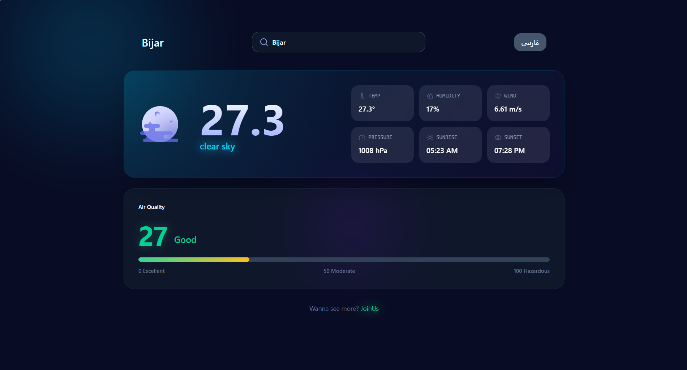
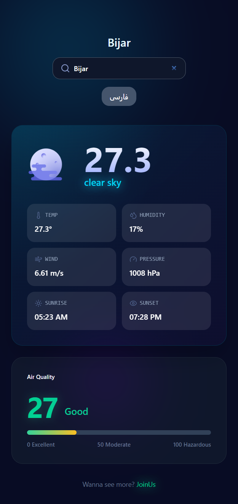

# Weather App

A responsive weather application built with React and TypeScript that displays real-time weather information using the OpenWeather API.


**Live Demo:** [View Website](https://hosseinnaseran.github.io/weather)

## Preview

### Desktop



### Mobile




## Features

- Search weather by city
- Display real-time weather information
- Temperature, humidity, and wind speed
- Responsive design for all devices
- Error handling for invalid city names
  
## Tech Stack

- React
- TypeScript
- CSS3
- Vite

## API

This project uses the OpenWeather API to fetch real-time weather information.

## Getting Started

```bash
git clone https://github.com/HosseinNaseran/weather.git

cd weather

npm install

npm run dev
```

## Author

**Hossein Naseran**

- [GitHub](https://github.com/HosseinNaseran)
- [LinkedIn](https://www.linkedin.com/in/hosseinnaseran)


---

⭐ If you found this project useful, consider giving it a star on GitHub.
